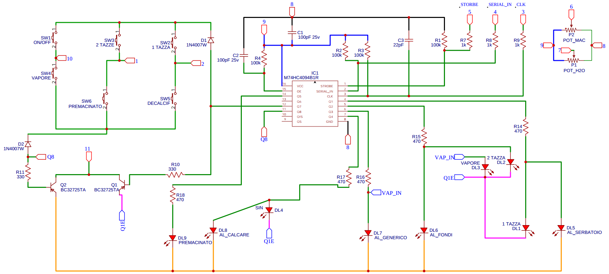
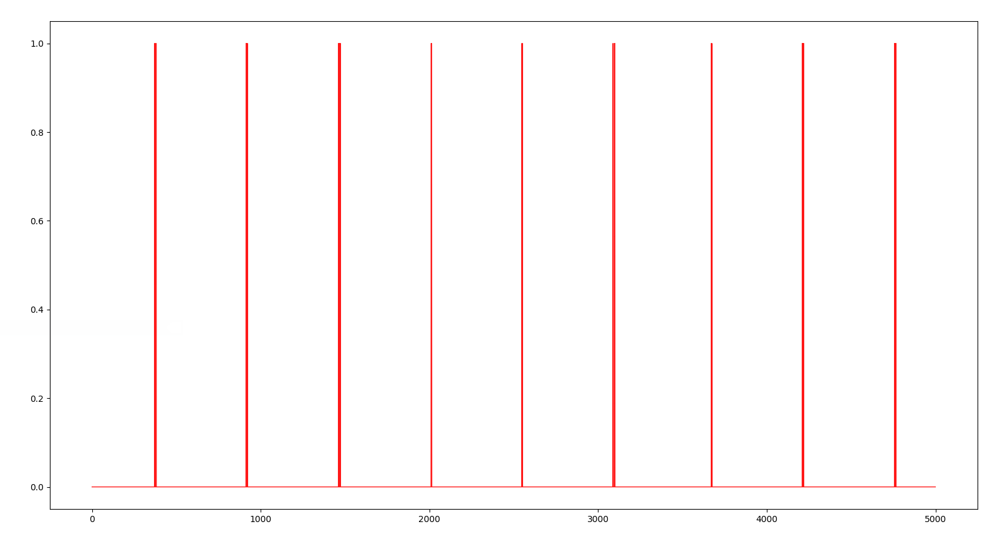
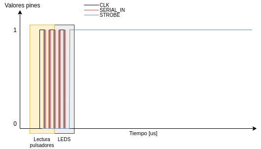
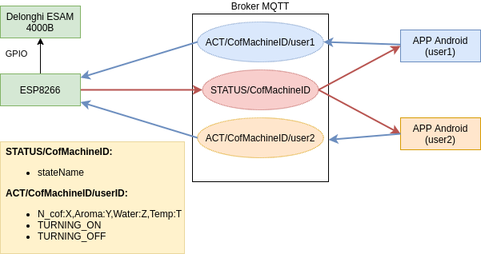
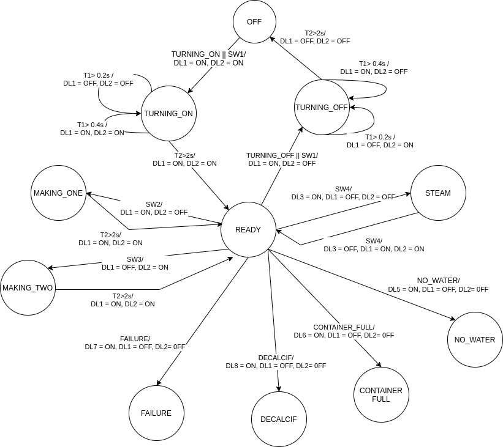
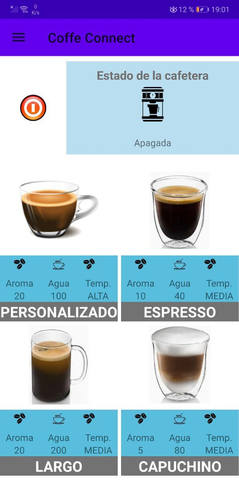
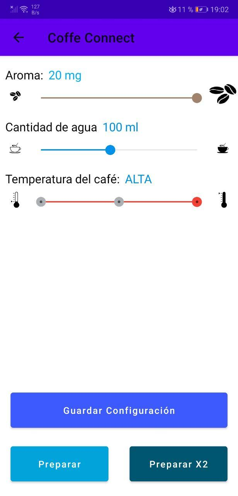
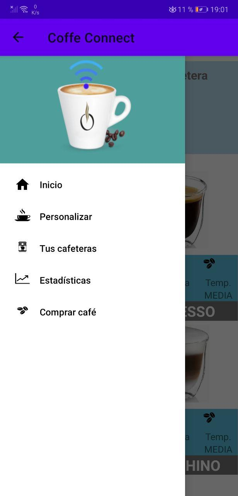

# smart-coffee-maker

## Intro
This works aim to apply reverse engineering to a fully
automatic **DeLonghi ESAM 4000**. 

First, the **electrical circuit** of the control panel is obtained. This is used to discover the communication protocol between the main embedded system and the user interface or control panel. 

Moreover, an **Android app** will be developed to allow users to managed their coffee machine. It will communicate with an ESP8266 via **MQTT protocol**. The **ESP8266 module** will employ the previously discovered protocol to control the coffee machine.

Note: **In the following sections a brief tutorial is presented, for further information please take a look at [the report](docs/../doc/article.pdf)**

## Build
- To analyze communication protocolo connect the appropriate pins to the raspberry and execute the following command:

    `python3.7  src/reverse_engineering/pi_scope.py`
    Please make sure you have previously setup in the script the pins to be read.
- To simulate the coffe machine and handle the control panel load the firmware to an ESP8266 and connect the communication bus to I/O pins. Remember to change the WiFi and MQTT broker credentials. 
- To use the Android App execute the following commands. In addition, you will must complete the MqttInfo.java file with your MQTT broker credentials. 
    
    `cd src/CoffeConnect/ && ./gradlew`
    
    Finally install the app on your Android device.

## Reverse engineering
In order to control the coffe machine, you have to discover the panel circuit board and the communication protocol between the control panel and the microcrontoller. After that, an ESP8266 will be used to generate and read the required signals.

### 1. Control panel circuit
The [electrical circuit](doc/Schematic_DeLonghi_CP_structured.pdf) is find out by following the copper tracks on the reverse side of the control panel board. It is a sequential circuit and the key component is a 8-bit shift latchregister. 
Using this information, we can suppose that microcontroller sends
a bitstream through pin 4 _SERIAL\_IN_ to turn on some LEDs and then sets pin 5 _STROBE_ to low for freezing the register
outputs (keep the LEDs status over time).

### 2. Circuit simulation
By simulating part of the circuit, (the recording is replaced by an adjustable voltage source) we can extract the following truth table:

| Q7 | Q8 | Q7 supplied switch | Q8 supplied switch |Led connected to Q7 controlled trans. | Led connected to Q8 controlled trans. | 
|:---:|:---:|:---:|:---:|:---:|:---:|
|0| 0 | X | X | Unknown | Unknown |
|0| 1 | X | Read | Turn on | X |
|1| 0 | Read | X | X | Turn on |
|1| 1 | Read | Read | X | X |

### 3. Protocol discovery

To analyze the a Raspberry Pi 3B can be used. For that, you have to connect the CLK signal (pin 3) to a GPIO pins and program and interrupt one rising edges. In the ISR you also have to read the _SERIAL\_IN_ and _STROBE_ signals. Finally, draw them on a line graph ([python script](src/reverse_engineering/pi_scope.py)).
With this method you will not see all samples because the GPIO sampling rate (about 1MHz) is lower than the CLK frequency. So, for better results and a deeper analysis please apply one of the following step:
- Use a logic analyzer or oscilloscope insted of a Raspberry Pi. 
- Replace the python script with an Linux kernel module

### 4. Protocol definition
The following figure depicts the CLK signal. If plot it together with _SERIAL\_IN_ and _STROBE_ signals, we can appreciate that
during a short time interval is performing a reading of the control panel switches at high frequency (about 1MHz). Next, a bitstream is sent through the SERIAL_IN pin to achieve the desired outputs in the shift register (turn on/off the desired LEDs). Finally, the STROBE signal is set to low during a large interval to hold the status of the LEDs.

## Prototype development

### 1. Arquitecture
The development system consists of three
main nodes: an Android application, a mes-
sage broker and an ESP8266 module which
simulate the coffee machine and receive user
requests from Android application. The
communication protocol between the Android application and ESP8266 is MQTT.

### 2. Embbeded system
The ESP8266 module process the following Mealy machine state periodically to simulate the coffe machine. Besides, there is an timer interrupt which generate a PWM for CLK signal and all the other signals.

### 3. Android App
The Android application is composed of two
activities, a navigation bar and a
service in the background that listen to the
messages about changes on the coffee machine’s status.

## Legal info